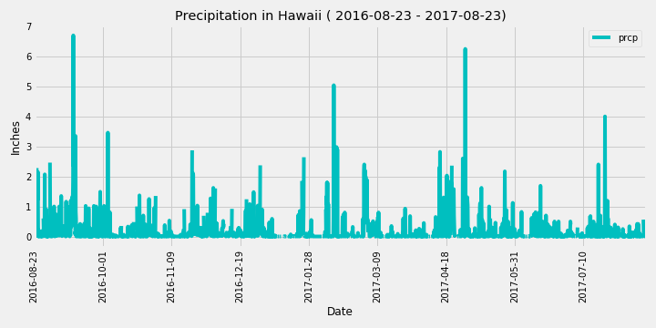
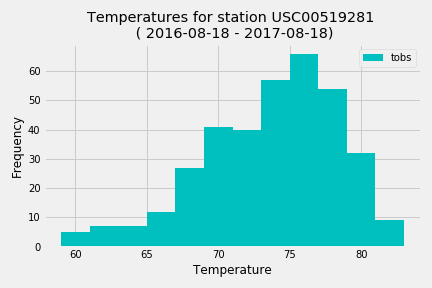
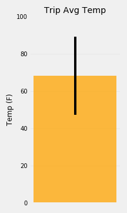
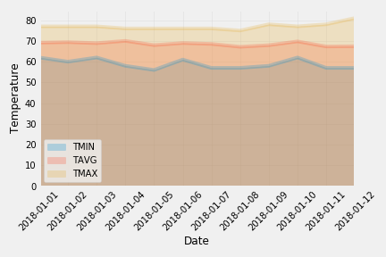

# SQLAlchemy Challenge - Surfs Up!

This mini project is a climate analysis in Honolulu, Hawaii, that would be used for vacation planning.
In this exercise , Hawaii's climate data was provided as a reference point and the following analysis was completed using SQLAlchemy, Pandas, Flask, Matplotlib.

### Precipitation Analysis

* A query to designed to retrieve the last 12 months of precipitation data from the data set provided , which was used for a precipitation plot.

  

### Station Analysis

* A query was designed to find the most active station, and retrieve the last 12 months temperature observations data(TOBS) for that station, which was used to plot a histogram.

  

### Climate API

* A Flask API was designed to create the routes for :
      ** Home Page
      ** Precipitation page that lists the Precipitation recorded for the last 12 months in the data set.
      ** Stations Information
      ** Temperature observations for the last 12 months of data for the most active station.
      ** The minimum ,average and the max temperature for a given start date or start-end range.

### Temperature Analysis I

* A query was designed to identify the average temperature in June vs December at all stations across all available years in the dataset. 

* A paired t-test was performed to check if it is statistically significant. 

### Temperature Analysis II

* Using a function , calculation was done for the min, avg, and max temperatures for a trip date range (using the matching dates from the previous year) 

* A bar chart was plotted using the average temperature and a peak-to-peak (TMAX-TMIN) error bar was plotted.

    

### Daily Rainfall Average

* Using a function ,calculation was done for the daily normals for a trip date range by considering all historic TOBS that match the date and month of the trip date range provided.

* An area plot was done for the daily normals.

  

